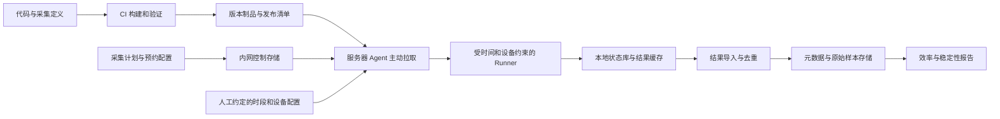

# KernelX msprof 自动性能采集与稳定性分析设计

状态：整体设计草案；issue #1 协议/探测和 issue #2 CANN Add 采集闭环已实现并在 910B1 验证，见 [探测验收](docs/910B1_VALIDATION.md)及 [采集验收](docs/ISSUE2_910B1_VALIDATION.md)。其余模块待实现。更新：2026-10-04。

## 1. 目标与前提

KernelX 面向 msprof 算子性能采集：在 Codex 无法连接的服务器上自主部署、按每天 1～2 小时的预约窗口运行、保存和回传数据，并支持跨日期、跨卡、跨服务器的稳定性分析。正确性评测不属于本工程必测范围；仅检查程序执行、采集完整性和性能数据质量，不把执行成功解释为数值正确。

初始规划时工程为空目录；当前协议与探测基础已交付。用户已确认目标服务器可主动访问内网存储或服务，采集使用 msprof、只考虑性能。覆盖库为 CANN（包含 ops-transformer 等算子组件）、sgl-kernel-npu、tile-kernels、deepgemm-ascend、deepep-ascend，并允许后续扩展。按 Linux + Ascend NPU、已有可用驱动/CANN 环境规划；已探测 910B1，其他服务器型号和各库目标版本尚待接入时确认。

必须具备的外部条件：

- 管理员一次性安装启动器、注册服务器身份、配置凭据与可使用的设备。
- 首版由人工与服务器使用者协商每日时间段和可用设备，将约定写入配置；Agent 在约定范围内自动执行，不需要每天人工启动。单靠检测当前利用率不能取得独占权。

## 2. 总体架构

采用服务器主动拉取的模式，Codex 只参与本地开发和制品准备，不处于生产运行链路。



| 模块 | 职责 | 首版建议 |
| --- | --- | --- |
| Release Builder | 构建应用、依赖、用例清单、版本清单 | CI + 按 CPU 架构构建的离线包 |
| Bootstrap/Supervisor | 开机启动、拉取、安装、进程监管和回退 | 小型稳定启动器 + systemd |
| Agent | 读取人工窗口配置、任务排队、截止控制、状态上报 | Python 服务 + 本地 SQLite WAL |
| Library Adapter | 定义各库用例、构建、环境、版本和支持矩阵 | 插件注册 + 独立运行环境 |
| Profiler Runner | 启动 benchmark 与 msprof、监管子进程、保存原始输出 | 子进程协议 + JSONL 清单 |
| Profile Parser | 导出 CSV/trace、case 归因、统一单位与指标语义 | 按 msprof 版本适配 |
| Metadata Probe | 设备映射、硬件 BIN、软件版本、状态探测 | 按产品和工具版本适配 |
| Uploader | 结果封包、校验、断点续传、幂等上传 | 本地 outbox + HTTPS/对象存储 |
| Analyzer | 时间预算评估、配对比较、稳定性与缺失报告 | Parquet + DuckDB + HTML/Markdown |

首版控制端使用“发布清单 + 人工窗口配置 + 计划文件 + 对象存储”，不要求建设自动预约服务。人工窗口配置记录约定版本、适用日期、服务器和设备，所有使用者按约定让出资源；Agent 检测冲突并跳过或中止。效率报告提供增加/减少时间、轮转库和多卡安排的依据，由人工协商并修改配置。后续需要自动协调时，再接入调度器或共享租约服务。

## 3. 无人值守部署与恢复

当前实现进度（2026-10-04）：#1 协议/探测、#2 固定 CANN Add Runner 和 #3 单 worker 预约 Agent/WAL 恢复/幂等中心导入已实现并在 910B1 验证。#3 提供 timer 调用的独立 CLI，不安装长期预约；#4 发布/启动、#5 扩展库与多 rank、#6 成本与稳定性分析仍待实现。详见 [Agent](docs/AGENT.md) 与 [实机验收](docs/ISSUE3_910B1_VALIDATION.md)。

### 3.1 发布物

每个 release 是不可变制品，包含采集程序、锁定依赖、探测适配器、用例清单和 manifest。各库分别锁定版本与环境，避免 Python、torch_npu、CANN 或 JIT 工具链要求冲突。manifest 至少有：

`release_id / git_commit / artifact_sha256 / signature / cpu_arch / supported_soc / supported_cann / supported_msprof / library_manifests / runner_protocol_version / schema_version / case_manifest_hash`。

根据实际 CANN、Python、glibc 和 CPU 架构构建兼容包，不能直接打包开发机虚拟环境。目标服务器运行时不依赖联网安装 pip 包。可选容器模式使用固定 image digest，并验证宿主驱动兼容性。

服务器目录建议：

```text
/opt/kernelx/bootstrap/        稳定启动器
/opt/kernelx/releases/<id>/    不可变应用与独立依赖
/opt/kernelx/current           当前版本指针
/etc/kernelx/                  服务器身份、预约策略、凭据引用
/var/lib/kernelx/state.db      任务、窗口、上传状态
/var/lib/kernelx/spool/        尚未确认导入的结果
/var/cache/kernelx/            内容寻址的编译缓存
```

### 3.2 自动更新流程

1. 启动器周期拉取分架构、分硬件组的发布清单，校验可信签名及内容哈希。
2. 下载到 staging，验证兼容性、磁盘空间、依赖导入和 schema 支持。
3. 进入允许维护的时间段；涉及 NPU 的 smoke test 必须使用人工约定的设备窗口，并计入预算。
4. 等待当前任务结束，保留旧版本，原子切换版本指针。
5. smoke test 成功后启用新版本；失败则回到上一健康版本，并隔离失败 release，避免反复安装。
6. 正在运行的 session 固定 release、plan、协议和环境快照；更新只在 session 边界生效。

自动部署范围是 KernelX 应用、依赖和采集定义。宿主驱动、固件和共享 CANN 的升级走服务器原有维护流程；采集系统读取其真实版本和漂移状态。应用更新不得隐式改变其他使用者的宿主环境。

### 3.3 持久状态与故障恢复

窗口状态：`PLANNED → WAITING_WINDOW → PREFLIGHT → RUNNING → DRAINING → CLOSED`，终态注明 `COMPLETED / PARTIAL / SKIPPED / FAILED`。

任务状态：`PENDING → RUNNING → SUCCEEDED / REJECTED / FAILED / INTERRUPTED`。上传状态单独记录，不能因为上传失败重跑已经完成的采集。

- 每个 case 的完整输出先落盘、fsync、校验，再原子登记完成；文件已存在但数据库未提交的情况在启动时扫描恢复。
- 重启后将未完成 attempt 标为 INTERRUPTED，从下一个完整 case 继续。部分样本不得伪装成完整成功样本。
- 每个 observation 有唯一 ID；传输采用至少一次投递，中心端按 ID 去重，重新测量则创建新的 attempt/observation。
- 原始 msprof PROF 目录、导出 CSV/trace、汇总、日志、环境快照一并封包；中心确认校验并持久导入后才允许本地清理。采集成功但导出失败可离线重试解析，不重新占用设备。
- 网络失败使用有上限的指数退避。缓存满时暂停新任务，保留未确认数据，形成明确异常状态。
- 本地 supervisor 检查进程心跳；中心检查最近成功 session 和最近上报时间。心跳正常不等于采集正常。
- 如果控制端不可达，只执行尚未过期、人工约定仍有效的缓存计划；过期配置或资源归属不明不启动采集。

## 4. 每天 1～2 小时的资源协调

### 4.1 人工定义窗口，Agent 自动执行

每台服务器配置时区、星期、开始/结束时间、允许使用的物理设备/芯片、并发数和维护限制，支持每天不同的时段、停采日期和有效期。示例窗口为北京时间每日 02:00–03:30，可配置为 60、90 或 120 分钟；具体时间由人工协商，不由 Agent 自行调整。

持久化每日窗口 ID，防止重启或定时器重复触发造成重复占用；错过窗口不在白天补跑。时间戳存 UTC，窗口按配置时区解释，进程内耗时使用单调时钟。

进入人工约定窗口后才做 preflight；确认约定有效、设备健康、没有外部占用才运行。本机 flock 防止 KernelX 自身重复启动，不能阻止其他使用者；设备可见性变量仅负责选择设备。首版独占来自人工协调。窗口配置可撤销，Agent 在任务边界检查配置是否仍有效；后续可把这一接口替换成自动租约校验。

服务器策略与任务计划分开：服务器策略限定资源使用上限，计划不能覆盖这个上限。配置示意如下，设备 ID 仅示意，实际从注册的物理身份映射得到：

```yaml
server_policy:
  reservation_mode: manual
  reservation_id: "<human-agreement-id>"
  schedule_revision: 1
  valid_until: "<agreed-expiry-date>"
  timezone: Asia/Shanghai
  weekdays: [1, 2, 3, 4, 5]
  window: {start: "02:00", end: "03:30"}
  skip_dates: []
  allowed_devices: ["<registered-device-uid>"]
  max_workers: 1
  cleanup_reserve_seconds: 300
  task_timeout_seconds: 60
  missed_window: skip
  spool_high_watermark: 0.8
plan:
  plan_id: "perf-daily-v1"
  profiler_preset: "latency-v1"
  libraries:
    - cann
    - sgl-kernel-npu
    - tile-kernels
    - deepgemm-ascend
    - deepep-ascend
  select_only_verified_combinations: true
  anchors: "anchors-v1"
  case_manifest: "<immutable-manifest-hash>"
  repeat_policy: "matched-window-repeats-v1"
```

测量前检查设备健康、已有进程、CPU/内存压力、允许频率/功率配置、温度及磁盘容量。窗口内按固定低频率采样状态，并评估采样开销。即使预约设备空闲，同机其他业务仍可能通过 CPU、内存带宽、供电和散热影响结果，必须记录。

检测到外部占用或人工窗口配置被撤销时，停止下发新的 case，结束自己的任务；相关数据标记为受干扰，保留原始记录。不得结束其他用户进程。跳过和提前结束消耗的协商机会必须进入效率报告。

### 4.2 预算与硬截止

窗口内预算包含预检、设备初始化、必要编译、预热、msprof 启动/采集/结束、重复、异常重试和清理。采集结束并确认设备释放后，msprof 导出、解析、压缩和上传优先放在窗口外低优先级执行；同时单独限制 CPU、I/O 和本地缓存。下载、CPU 编译也可窗口外执行，不能把后台开销隐去。

以 90 分钟单卡窗口为初始分配示例：

| 环节 | 时间 | 目的 |
| --- | ---: | --- |
| 预检、初始化、热状态准备 | 5 分钟 | 确认环境与资源可用 |
| 固定锚点集，分布在开头/中间/末尾 | 10 分钟 | 跟踪漂移并连接不同窗口 |
| msprof 覆盖任务和异常复测 | 70 分钟 | 由预算计划器分配 |
| 清理和释放设备 | 5 分钟 | 结束本窗口占用 |

以上只是初始预算，不是容量结论。60/120 分钟窗口按实测固定成本重新计算。

- 用历史 p95 总成本估计 task，附加安全系数；没有历史时先分配小规模 pilot。
- 仅当 `剩余约定时间 > task 预算上界 + 清理预留` 时启动下一 task。
- Runner 将长任务拆成有限时长的块，默认目标为每块最多 60 秒；超时和重试均消耗窗口预算，禁止自动延期。
- 软截止停止新任务、提交已完成 case；硬截止监管进程终止本任务组并确认设备释放。
- 杀进程不保证故障设备立即释放上下文。若检测到自己的设备资源残留，隔离该设备、记录失败并交由已有运维机制处理。目标服务器必须通过超时和上下文释放测试，才能承诺共享窗口的按时交还；不自动复位共享 NPU。

### 4.3 多卡执行

首轮每台服务器只运行一个采集 worker，建立干扰基线。验证多卡并发不会显著改变锚点性能后，才提高 `max_workers`。记录 CPU affinity、NUMA、芯片/物理卡对应关系和其他活跃卡；多芯片板卡不能简单把逻辑 ID 数量当成物理卡数。

deepep 等多 rank 任务由人工约定全部参与卡/服务器的共同窗口；只有全组资源可用、各 rank 就绪时才统一启动，结束时间取各机器约定窗口的最早截止。不能拿到部分卡后无限等待剩余卡。单 rank 失败或窗口撤销时取消本任务的全部 rank。任务 device-hour 是所有参与设备占用时间之和。多机稳定性分析以整个通信组为实验单位，不能把各 rank 当成互相独立的单卡实验。

## 5. 采集效率评估与自适应计划

本阶段的核心交付是[采集效率与机时协商报告](EFFICIENCY_REPORT.md)。报告按“库 × 固定版本 × 硬件/环境组 × 采集范围”给出试采成本，推演每日 60/90/120 分钟方案及完成周期，再反推指定日覆盖/更新周期所需机时。Agent 可以在既定窗口内选择任务，但不能根据报告自行增加时段或设备。

“每天采多少库”同时给出触达库数、完成核心清单库数、完成全量清单库数和各库覆盖百分比。运行某库一个用例不等于采完这个库。核心/全量用例清单、目标卡、重复轮次和 profiler preset 必须在协商前明确并冻结。

### 5.1 指标定义

效率统计同时报告服务器小时、物理卡小时和逻辑芯片小时，避免多卡并行造成数字虚高。服务器小时按每台服务器约定或实际占用区间的并集累计；卡小时按物理卡累计；芯片小时按参与芯片累计。约定资源与实际资源分别统计，多芯片板卡的身份映射决定换算，不能把芯片小时直接称为物理卡小时。

| 指标 | 定义 |
| --- | --- |
| 采集成功率 | benchmark 正常完成且 msprof 原始产物完整的 attempts / 已启动 attempts |
| 解析成功率 | 完成导出、schema 校验及 case 归因的 profiles / 完整 profiles |
| 有效率 | 满足质量门槛的性能观测 / 已解析并完成归因的性能观测；另报有效观测总数 |
| 有效吞吐 | 有效观测数量 / 实际占用设备小时；同用例复测也计入 |
| 新增覆盖吞吐 | 首次完成的 case × 目标硬件/环境组数量 / 实际占用设备小时 |
| 覆盖率 | 已获得有效数据的必测组合 / 预先冻结的必测组合 |
| 单位有效成本 | 窗口内总占用设备秒 / 有效观测数量 |
| 时间开销 | 编译、初始化、预热、msprof 启停/采集、重试、清理分别统计；导出/解析/压缩另记后台成本 |
| 预约利用率 | 已实际占用设备秒 / 已预约设备秒 |
| 按时交还率 | 按硬截止确认资源释放的窗口 / 已启动窗口 |
| 数据可用时延 | 中心导入完成时间 − 本地观测完成时间 |

新增覆盖吞吐与复测吞吐分开看；一次最快结果不代表完成稳定性采集。必测组合数量在计划发布时冻结，避免动态删任务抬高覆盖率。权限不足和“不支持”的能力缺失单列，不能算作成功覆盖。

### 5.2 任务选择

每个 task 提供 `priority / required_cohort / library_id / profiler_preset / resource_group / estimated_p95_seconds / estimated_profile_bytes / cost_uncertainty / retry_budget / deadline / last_valid_at`。同时约束设备窗口、spool 空间及导出积压，防止采集快于处理造成缓存耗尽。

在完成固定锚点和必测配对任务后，以“新增覆盖价值、稳定性不确定度降低、数据过期程度 / 预计成本”排序，并给长任务保留轮转配额，避免只采容易完成的小 shape。优先级权重和任务选择原因随计划保存。

编译缓存 key 包含源代码/依赖哈希、编译器版本、编译选项、目标 SoC/BIN、相关 CANN/算子库指纹；不能仅按 shape 或文件名复用缓存。

预热和重复次数采用有上限的自适应策略：达到热状态和预先声明的稳定性门槛可结束，达到上限仍不稳定则保留并标记。保存实际次数、停止原因、协议版本；确认性比较采用统一协议，避免不同停止规则引入选择偏差。

### 5.3 容量估计

设窗口 `W` 秒、固定开销 `F` 秒，平均一个完整观测成本 `c` 秒，有效比例 `q`：

`预计有效观测 ≈ floor((W − F) / c) × q`。

例如单卡 90 分钟、固定开销 15 分钟、每次完整观测 8 秒、有效比例 90%，约 506 个有效观测/天。此例只是算术演示，8 秒和 90% 均待实测；不是 506 个用例都获得足够跨日复测数据。

Pilot 建议运行 3 个窗口，按算子族、shape 规模、dtype 和模式采样，分别测冷缓存/热缓存成本。输出 60/90/120 分钟预计容量、关键必测矩阵完成天数、成本长尾、失败瓶颈及置信范围。持续用实际账本修正成本估计，不以 kernel 内部耗时替代端到端成本。

## 6. 跨服务器、跨卡、跨日期稳定性

### 6.1 比较单位和实验设计

case key 由算子、输入/输出 shape、dtype、layout、stride、属性和输入生成规则确定。比较实现 A/B 时，还需相同 seed/input hash、计算/通信语义、计时边界、协议、并发和热状态约束。接口同名不代表语义一致；默认先分析同一库同一实现的稳定性，跨库性能比较只对明确匹配的用例进行。

三种分析分别输出：

1. 同芯片跨时间：窗口内抖动、跨窗口/日期漂移。
2. 同服务器不同芯片：在相同环境及 BIN 下识别卡间差异。
3. 不同服务器：匹配硬件和软件组后比较系统差异；硬件 BIN 或版本不同则形成独立对照组。

固定锚点集覆盖计算密集、带宽密集和小算子调度密集任务，所有目标设备使用同一版锚点；其余大规模用例按预算分日轮转。每个需要比较的 case 在各组上安排匹配重复，而不是每台服务器采互不相交的子集。

同环境比较键至少包含：SoC、已确认 BIN、驱动/固件、运行算子库指纹、框架、实现、msprof 版本与 preset、解析器语义版本、计时协议、编译参数和并发模式。通信任务还包含 world_size、rank 映射、链路/拓扑、HCCL/HCOMM/URMA 等实际依赖版本、通信字节数及路由/负载分布。跨 BIN 分析作为明确的硬件规格对照；跨库版本分析作为版本对照，不能混入“同规格卡间稳定性”。

初始稳定性 pilot 目标是 ≥2 台服务器、每台 ≥2 个可比较芯片、≥3 个不同日期窗口；如资源不足，报告只能覆盖的比较维度。该规模用于发现问题，不保证统计功效。每日安排独立轮次，保存执行顺序及随机化种子；A/B 比较使用配对且顺序平衡的轮次。

### 6.2 msprof 采集与指标协议

msprof 是本工程的主采集通道。首版先固定一个低开销的 `latency` preset，用于任务时长与必要的归因信息；第二个 `pipeline` preset 用于 AI Core、内存访问等诊断指标，单独回放采集，避免额外计数器影响主稳定性序列。preset 的参数和支持情况在各目标 CANN/msprof 上做能力检测，并保存最终命令，不能静默降级后仍使用相同 preset 名。

官方文档区分 op_summary 的单任务耗时与 op_statistic 的类型级汇总；Task Duration 可用于任务性能分析。[msprof 结果分析说明](https://www.hiascend.com/document/detail/en/canncommercial/800/devaids/profiling/atlasprofiling_16_0007.html)。命令形式和参数由版本适配层生成。[msprof 命令参考](https://www.hiascend.com/doc_center/source/en/CANNCommunityEdition/910/devaids/Profiling/atlasprofiling_16_0011.html)。

统一协议：

1. 在计时区域之外准备输入、完成 JIT/编译、初始化和预热；按版本支持的采集边界或已验证的过滤方式排除这些阶段。不能仅“删除前 N 行”猜测预热。
2. Runner 写入 case、iteration、phase、rank 的 sidecar；通过支持的标记/API 关联或验证过的 task/stream/时间边界实现归因。初版优先一个 case 一个 profile；批处理仅在归因验证通过后启用。
3. 程序退出成功、原始 profile 完整、导出完成、目标任务数量/字段/单位符合预期才构成完整性能观测。没有匹配到目标任务是失败/不支持，不是零耗时。
4. CSV 按列名和单位解析，保留未知列及原始版本；msprof/导出器版本变化触发 schema fixture 验证。trace 丢失、归因不明确和单位未知的结果保留但不进入稳定性比较。
5. 不把多 stream 的 Task Duration 简单相加作为算子端到端延迟。分别保存 `task_duration_us`、明确任务集合的 `device_span_us`、具备相关关系时的设备关键路径时间，以及可选同步 host 端到端时间，记录其边界和指标定义。
6. 融合/多 kernel 实现保存一个 logical invocation 到多个 task 的映射。单 kernel 原始样本与 invocation 级汇总分别保存；op_statistic 不能替代迭代级样本。
7. 多 rank 任务保存逐 rank 数据和完整组状态；组延迟用已同步、已定义的每 rank 完成耗时取最大值。跨主机时间戳不能直接相减；通信带宽使用明确的有效字节定义，不能直接从 kernel 名称推断。
8. 保存每轮原始样本及聚合结果，不能只存最小值。批内迭代用于描述噪声，不能当成许多独立日期样本。
9. 记录前/中/后温度、频率、功率、利用率、外部占用、CPU/NUMA 状态；缺失监测能力降低质量等级。

所有结果明确标为 msprof 下的性能。可用少量相同用例的无 profiler 时间作为开销校准，但它是可选独立对照，不增加默认采集范围，也不混入 msprof 主序列。

### 6.3 分析与报告

| 层级 | 统计输出 | 解释范围 |
| --- | --- | --- |
| 窗口内 | 中位数、p95、IQR、MAD/median、CV | 单窗口重复的抖动；CV 用于辅助诊断 |
| 同芯片跨日 | 每日中位数的离散度、相对基线漂移 | 时间稳定性 |
| 同服务器卡间 | 同 case、同日期配对比值与分布 | 卡间差异 |
| 跨服务器 | 匹配 case/协议/环境组的比值及区间 | 主机差异与残余混杂 |
| 多用例汇总 | 配对延迟比值的几何均值 + 最差用例 | 避免平均绝对延迟被大用例支配 |

置信区间按日期/窗口等独立实验单位做分层或聚类 bootstrap；必要时使用 `log(latency) ~ case + hardware_bin + software_version + server + device(server) + day` 的分层分析。若服务器与 BIN/软件版本完全绑定，不能从数据中区分这些因素，需要补充交叉测量，不能把回归结果当因果证明。

告警同时要求实际差异超过预设阈值和独立复测支持；大量用例比较需控制多重检验。可先配置“窗口内 MAD/median >2%、相对漂移 >5% 时安排复测”作为 pilot 触发值，后续按算子族的噪声底校准，不作为硬件通用标准。

质量标签采用多值：`VALID / CONTENDED / UNSTABLE / THERMAL_DRIFT / VERSION_CHANGED / METADATA_INCOMPLETE / INSUFFICIENT_DATA` 等。异常数据保留，分析时显式选择规则。硬件、版本未知的数据可用于描述性报告，不能进入严格同组比较；异常卡需在干净预约窗口复测后再归因。

报告必须展示缺失矩阵和样本数量：没有覆盖、元数据未知、质量不合格、执行失败、样本不足分别计数。避免仅分析成功数据造成幸存者偏差。

## 7. 数据结构与字段

采用“不可变环境快照 + 采集 session + 原始 observation + 汇总”的结构。分析导出视图将硬件 BIN 和算子库版本展开到每一行，避免只存在于日志。

| 实体 | 核心字段 |
| --- | --- |
| Server | server_id（注册 UUID）、hostname、CPU/NUMA、OS/kernel、CPU 架构 |
| Device | device_uid、card_uid、身份可信度、SN/Die ID/PCIe、npu_id、chip_id、逻辑 ID 映射 |
| HardwareSnapshot | soc_family、chip_name_raw、npu_name_raw、hardware_bin、bin_status、bin_source、bin_mapping_version、board_id、HBM、driver/firmware、npu_smi_version、原始输出 URI |
| SoftwareSnapshot | toolkit_version、operator_libraries、msprof_version、运行/编译环境指纹、框架/通信/JIT 工具链版本、release_id、git_commit |
| Plan | plan_id/hash、case_manifest_hash、预约、成本预算、协议版本、优先级 |
| Session | session_id、server/device、环境快照 ID、人工约定 ID/配置版本/窗口 ID、起止时间、资源账本、终态 |
| Observation | observation_id、profile_id、task_id、attempt、case_key、input_hash/seed、轮次、rank、指标定义、原始耗时、采集完整性、质量标签 |
| ProfileArtifact | 原始 PROF URI/hash、导出 CSV/trace URI/hash、preset/hash、采集/导出器/解析器版本、case/task 关联、丢失与解析状态 |
| Summary | case/设备/环境组、独立窗口数、有效/失败数量、中位数、p95、离散度、区间、分析版本 |

### 7.1 硬件 BIN 探测

启动、每个窗口开始以及环境变化时探测设备映射和详细信息，保存命令、退出码、stdout/stderr、时间、权限范围及解析器版本。

官方文档说明 `npu-smi info -l` 提供 NPU ID，`info -m` 提供芯片映射，`info -t board -i <id> -c <chip_id>` 查询芯片详情；支持字段和权限随产品/部署场景变化。[查询指定芯片信息](https://www.hiascend.com/doc_center/source/zh/Atlas%20200I%20A2/23.0.RC3/re/npu/npusmi_009.html)。A3 产品的目标规格还可能需同时读取 Chip Name 和 NPU Name。[官方算子工具说明](https://www.hiascend.com/doc_center/source/en/canncommercial/850/devaids/optool/atlasopdev_16_0034.html)。

BIN 必须与 Board ID、固件版本、算子二进制文件分开：

- 如目标工具明确输出 BIN 字段，直接读取，保存其原字段名和原值。
- 如目标服务器用 Chip Name 的完整规格区分 BIN，则经过实机输出/对应产品定义确认后，在版本化映射表中规范化。保留完整名称，不仅截取尾缀 B1/B2。
- 当前尚未取得目标服务器输出，不能预设所有产品都有同名 BIN 字段或统一查询命令。
- 解析失败/权限不足/不支持时使用 `null`，并设 `bin_status=UNKNOWN/PERMISSION_DENIED/UNSUPPORTED/PARSE_ERROR`；未知值不能匹配为同一 BIN 组。
- SN/Die ID 能取得时用于稳定身份；只有 PCIe 地址时只能作为服务器内位置身份，设备更换必须产生新身份或标记不确定性。逻辑 device 0 不是跨服务器唯一标识。

### 7.2 算子库版本与指纹

`operator_libraries` 是数组，覆盖 CANN OPP/ops、ops-nn、ops-transformer 等独立组件、sgl-kernel-npu、tile-kernels、deepgemm-ascend、deepep-ascend 以及后续库。每个条目含 `name / role / version / version_status / resolved_path / package_id / repository_url / git_commit / dirty_tree_hash / artifact_sha256 / version_source / used_by_case`。区分用例所属库、实际 kernel 提供者和底层依赖，不能把所有库版本浓缩成一个 CANN 版本。Toolkit 版本与各算子库版本分别存储；不能用 Toolkit 或聚合 OPP 的版本代填 ops-nn、ops-transformer。未取得某组件版本时仍保留该组件条目，并记录 null、状态及原因。

版本探测在 Runner 实际环境中执行。优先记录实际加载的库路径及构建 ID/哈希，再关联版本文件/包元信息；解析符号链接，保存运行时搜索路径与自定义库优先级。容器内软件版本与宿主驱动版本分别采集。

传统环境可从实际 `ASCEND_OPP_PATH` 下的版本信息开始探测，具体文件按版本适配；较新 CANN 的官方指南分别提供 Toolkit 和 ops 安装信息文件，说明二者应独立记录。[CANN 软件版本查询](https://www.hiascend.com/document/detail/zh/CANNCommunityEdition/910beta3/softwareinst/instg/instg_0093.html)。

自定义库无语义版本时使用 commit 和制品哈希标识，版本号字段保持 null 并解释原因。执行同名算子可能命中不同库，必须在 case 结果中关联实际实现来源；无法确认时标记 `DECLARED_ONLY`，不得当成已验证加载版本。编译环境与运行环境分别保存。共享软件运行期间发生变化则终止当前可比较 session，并创建新快照。

### 7.3 库适配与支持矩阵

统一适配接口为 `capabilities / enumerate_cases / build / resolve_versions / prepare / benchmark_command / attribution_spec / metric_spec`。benchmark 只执行准备、预热和性能循环；如上游测试混合正确性与 benchmark，应提取性能入口，不直接运行全量测试套件。

| Library Adapter | 版本采集重点 | 采集差异 |
| --- | --- | --- |
| CANN / ops-transformer 等 | Toolkit 与 ops 包、组件 commit、实际 ACLNN/其他 API 库与 kernel 制品 | 组件拆分、实际 API 到设备 task 的映射 |
| sgl-kernel-npu | 安装包版本、仓库 commit、C++/Ascend 扩展哈希、torch_npu | 扩展与 CANN 依赖共同固定 |
| tile-kernels | 包版本/commit、TileLang/编译器、JIT 产物哈希、实际后端 | 强制确认使用 Ascend 后端，隔离首次编译 |
| deepgemm-ascend | 包版本/commit、DeepJIT/编译器、扩展与 device kernel 哈希 | GEMM 参数、精度、布局和编译选项 |
| deepep-ascend | 包版本/commit、DeepJIT、HCCL/HCOMM/URMA 等依赖、HDK/固件与配置 | 多 rank 启停、拓扑、同步、异步完成边界 |

支持矩阵按 `library revision × SoC/BIN × CANN × Python/torch_npu × msprof preset` 固定，并保存已验证日期。**支持某个库不意味着该库能在所有服务器上运行。**截至设计查阅时，TileKernels 的 Ascend 后端要求 Ascend 950，DeepGEMM-Ascend 的公开验证目标也是 Ascend 950；DeepEP-Ascend 明确表示其他代际尚未建立支持。实际使用 910B 等设备时必须先验证目标 revision，不能直接全量部署。[TileKernels](https://github.com/deepseek-ai/TileKernels)、[DeepGEMM-Ascend](https://github.com/deepseek-ai/DeepGEMM-Ascend)、[DeepEP-Ascend](https://github.com/deepseek-ai/DeepEP-Ascend)。

依赖链也随版本记录：例如某用例所属库可能调用另一库或 JIT 后端。任务调度以能力矩阵为过滤条件，不支持的组合保留原因并从预先定义的适用集合中说明，不能反复失败重试。

### 7.4 一行导出示例

以下为字段示意，不代表实测；硬件 BIN 和版本需由目标环境填充。

```json
{
  "schema_version": 1,
  "observation_id": "<uuid>",
  "session_id": "<uuid>",
  "server_id": "<registered-uuid>",
  "device_uid": "<stable-chip-identity>",
  "card_uid": "<physical-card-identity>",
  "npu_id": 0,
  "chip_id": 0,
  "hardware_bin": null,
  "bin_status": "UNKNOWN",
  "bin_source": "<command-and-output-field>",
  "chip_name_raw": "<probe-value>",
  "driver_version": "<probe-value>",
  "firmware_version": "<probe-value>",
  "toolkit_version": "<runner-environment-value>",
  "operator_libraries": [
    {
      "name": "ops-nn",
      "role": "kernel_provider",
      "version": {
        "value": null,
        "status": "UNKNOWN",
        "reason": "component version metadata has not been collected",
        "source": [],
        "confidence": "NONE"
      },
      "resolved_path": null,
      "package_id": null,
      "repository_url": null,
      "git_commit": null,
      "dirty_tree_sha256": null,
      "artifact_sha256": null,
      "load_status": "DECLARED_ONLY",
      "used_by_case": []
    },
    {
      "name": "ops-transformer",
      "role": "kernel_provider",
      "version": {
        "value": null,
        "status": "UNKNOWN",
        "reason": "component version metadata has not been collected",
        "source": [],
        "confidence": "NONE"
      },
      "resolved_path": null,
      "package_id": null,
      "repository_url": null,
      "git_commit": null,
      "dirty_tree_sha256": null,
      "artifact_sha256": null,
      "load_status": "DECLARED_ONLY",
      "used_by_case": []
    }
  ],
  "protocol_version": "msprof-v1",
  "profile_id": "<uuid>",
  "msprof_version": "<probe-value>",
  "profiler_preset": "latency-v1",
  "profiler_config_hash": "<hash>",
  "profile_raw_uri": "<internal-storage-uri>",
  "parser_version": "<version>",
  "case_key": "<canonical-case-hash>",
  "input_seed": 42,
  "timing_mode": "msprof_task_duration",
  "metric_scope": "device_task",
  "rank": 0,
  "world_size": 1,
  "batch_iterations": 100,
  "latency_samples_us": [],
  "quality_flags": ["METADATA_INCOMPLETE"]
}
```

接口校验要求字段存在；允许 null 必须伴随状态和原因。完整原始样本单独存 Parquet/JSONL，快照和版本来源随结果长期保留；后续升级解析器可以重新解释历史输出。

## 8. 工程划分与实施顺序

```text
kernelx/
  bootstrap/     拉取、安装、切换和回退
  agent/         计划、人工窗口配置、状态和监管
  libraries/     各库版本、用例、构建与兼容性适配
  runner/        benchmark、msprof、单机/多 rank 监管
  profiling/     导出、归因、指标语义与版本化解析
  probes/        npu-smi、设备身份和软件版本
  storage/       schema、本地 outbox、导入和去重
  planning/      成本模型、覆盖和复测调度
  analysis/      稳定性、效率、缺失矩阵和报告
configs/         服务器、硬件映射、协议和计划
deploy/          离线打包、systemd、安装文档
tests/           协议、故障恢复、探测样本和集成验证
```

实施依赖顺序：

1. **协议与探测**：定义 case/profile/observation/schema，取得各类目标机的 npu-smi、库版本和 msprof 输出，完成设备身份、BIN 和支持矩阵适配。
2. **单机闭环**：优先用目标机已支持的 CANN 用例实现 msprof 采集、导出、归因、离线安装、开机启动、窗口截止、checkpoint、outbox、结果导入；模拟断网、重启和卡占用。
3. **自动发布**：制品验证、兼容性、原子更新、失败回退、坏版本隔离。
4. **成本 pilot 与机时协商**：在人工定义的窗口试采，最低 3 个窗口，复杂或多 rank 库允许追加；生成效率报告、每日 60/90/120 分钟库覆盖方案和目标更新周期所需机时，由人工选择后更新配置。
5. **扩展与稳定性矩阵**：接入其余库的适配器，验证支持矩阵；配置 deepep 全组共同窗口，多服务器、多卡、跨日期锚点和配对任务，形成分组报告。自动预约服务作为后续可选扩展。

各阶段均通过上一阶段验收后扩大规模；不在容量未知时安排全量长期采集。

## 9. 验收标准

| 需求 | 可验证验收 |
| --- | --- |
| 无 Codex 自动运行 | 初始接入后连续 7 天，无远程交互地按计划执行；跳过窗口也有明确原因 |
| 自动部署 | 发布新 release 后服务器主动获取并切换；错误签名/不兼容版本被拒绝；坏版本回退且不循环更新 |
| 1～2 小时窗口 | 60/90/120 分钟预算模拟及实机截止测试；记录设备真实释放时间；发现残留时隔离 |
| 人工时段协调 | 只在有效约定时段和设备范围启动；支持每日配置、撤销、有效期和停采日期；冲突、撤销、错过窗口均不越权补跑 |
| 自动采集和回传 | 断网后本地持续缓存，恢复后自动回传；重复上传无重复观测；重启不丢完整 case |
| msprof 数据质量 | 已知迭代数可映射到目标 tasks；预热/编译剔除可验证；缺失/丢失 trace 不算有效；保存原始 PROF 和导出数据 |
| 效率可量化 | 按库报告成功/有效率、成本分解、资源小时；给出每日 60/90/120 分钟能完成的核心/全量范围、轮转周期、目标覆盖所需机时和预测误差；所有容量结论关联实测 |
| 数据稳定性 | 展示同芯片跨日、同机卡间、跨服务器三层结果；匹配分组、独立样本数与缺失矩阵完整 |
| 硬件 BIN | 每行有 BIN、状态及来源；未知 BIN 不进入严格同规格比较；原始输出可追溯 |
| 算子库版本 | 每行有实际库关联、版本/状态和指纹；更换库后产生新环境组，即使语义版本相同 |
| 库与硬件兼容 | 五类库均有适配和支持矩阵；只在已验证组合部署，不支持组合有明确状态 |
| 多 rank 任务 | 全组预约、失败传播、统一截止与资源释放可验证；不以部分 rank 产物冒充完整成功任务 |
| 可审计 | 每次结果可追溯到制品、代码、计划、协议、输入、设备、环境和原始样本 |

在目标服务器尚未接入前，可完成制品、schema、模拟 Runner、解析 fixture 和故障注入验证；设备释放、BIN 映射、真实库加载来源、msprof 归因/开销及采集容量需要服务器管理员运行首轮验收包并回传结果。后续部署、窗口运行和数据回传经内网自动完成，无需 Codex 介入。
